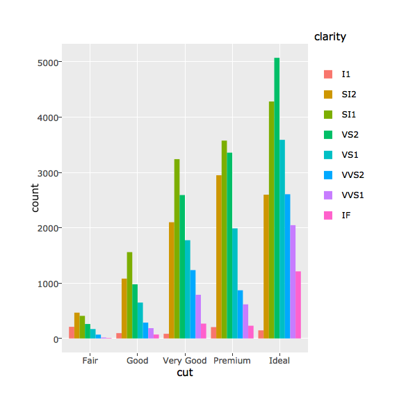

---
title       : 
subtitle    : 
author      : 
job         : 
framework   : html5slides   # {io2012, html5slides, shower, dzslides, ...}
highlighter : highlight.js  # {highlight.js, prettify, highlight}
hitheme     : tomorrow      # 
widgets     : [plotly]      # {mathjax, quiz, bootstrap}
mode        : selfcontained # {standalone, draft}
knit        : slidify::knit2slides
--- {class: class1, id: id1, bg: beige}

## Week 3 - R Markdown Presentation and Plotly  
  
Pouria  
July 8, 2017

--- {class: class2, id: id2, bg: beige}

## Plotly Presentation  
Plotly for Motor Trend Car Road Tests (mtcars) datasets
<iframe src="./graph.html"> </iframe>


```
## Warning: Specifying width/height in layout() is now deprecated.
## Please specify in ggplotly() or plot_ly()
```

```
## Warning in RColorBrewer::brewer.pal(N, "Set2"): minimal value for n is 3, returning requested palette with 3 different levels
```



```
## Warning in RColorBrewer::brewer.pal(N, "Set2"): minimal value for n is 3, returning requested palette with 3 different levels
```

